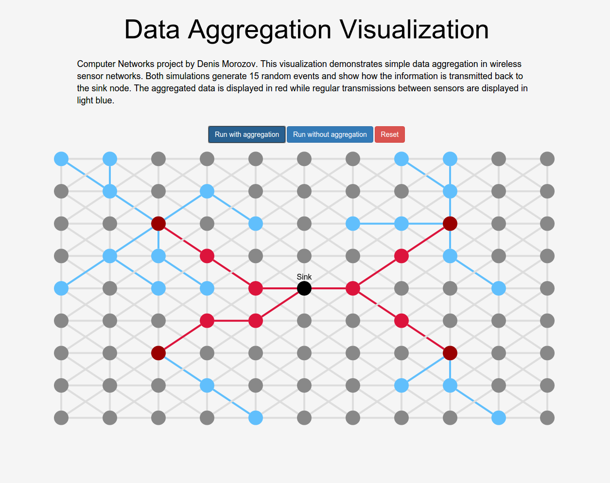

# Cytoscape.js Data Aggregation Visualization

This project is a visualization of the paths messages take in a graph while moving to a central sink node, demonstrating
the effects data aggregation has on network congestion and efficiency. It uses the [Cytoscape.js](http://js.cytoscape.org/)
library for graph algorithms (i.e. Dijkstra's) and rendering.

[Live Demo](denismorozov.com/graph)

## Running
Install the dependencies
'''
npm i
'''
start the development environment
'''
npm start
'''
then navigate to,
'''
http://localhost:8080/
'''

## Building

## To-Do
    - It would be cool to set the weights of all the edges to the actual (pixel?) distances. This would allow you to connect
    nodes only if it's within a certain distance to each other. This would allow you to move around each node (sensor)
    - Location based events
